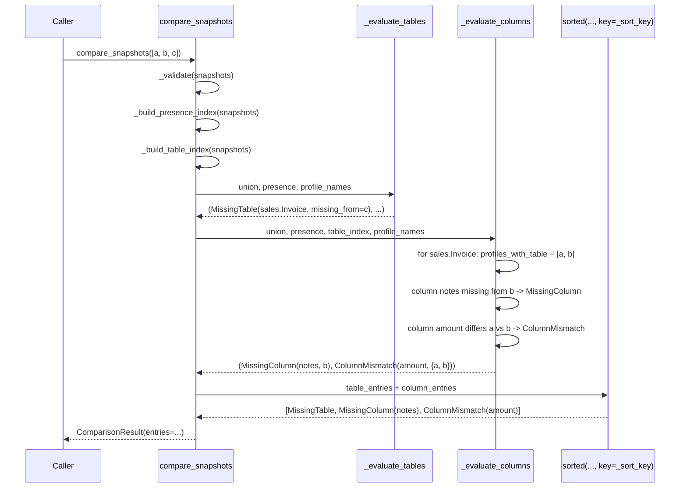

# Design: Diff Detection Completion (Change A)

Change: `diff-detection-completion`
Status: design (phase artifact)
Scope: extend `comparison-engine` with missing-column detection and column
attribute-mismatch detection — the two categories the prior
`comparison-engine` change deliberately deferred. Realizes REQ-006,
REQ-007, and the MODIFIED REQ-004 ordering rule in
`openspec/changes/diff-detection-completion/specs/comparison-engine/spec.md`.
No report/console rendering, no likely-rename heuristics, no `discovery/`
change (this design only reads `ColumnSnapshot`/`TableSnapshot.columns` as an
already-sorted, immutable input, exactly as
`openspec/changes/archive/2026-07-10-comparison-engine/design.md` established
for `MissingTable`).

This design is additive: it extends `compare/models.py` and
`compare/engine.py` in place, keeps `ComparisonResult`'s flat `entries`
shape unchanged, and does not touch `compare/errors.py` (no new precondition
category is introduced by this change, per the proposal's Non-Goals).

---

## 1. Module / file layout (unchanged shape, extended contents)

```text
src/schema_comparator/compare/
  __init__.py     # extended: export ColumnAttributes, MissingColumn, ColumnMismatch
  models.py       # extended: ColumnAttributes, MissingColumn, ColumnMismatch, widened DiffEntry
  errors.py       # unchanged
  engine.py       # extended: per-matched-table column pass + unified cross-type sort
```

No new module is added. The column pass is folded into `engine.py` as
private helper functions beside the existing table-level `_validate` /
`_build_presence_index` / `_evaluate`, per the proposal's explicit rejection
of "two separate per-concern passes" (exploration Q2). A separate
`column_engine.py` was considered and rejected — see §6 (Architecture
Decisions).

---

## 2. Data model changes (`compare/models.py`)

### 2.1 `ColumnAttributes` — the comparable subset of `ColumnSnapshot`

```python
@dataclass(frozen=True, slots=True)
class ColumnAttributes:
    """The comparable subset of ColumnSnapshot for mismatch detection.

    Deliberately excludes `ordinal_position` (a reorder alone is not drift)
    and `name` (identity, not an attribute — two columns are compared under
    the same name by construction). Frozen + slots makes instances
    value-comparable and hashable, so equality/`set()`-based distinctness
    checks in the engine work without custom `__eq__`/`__hash__`.
    """

    data_type: str
    character_maximum_length: int | None
    numeric_precision: int | None
    numeric_scale: int | None
    is_nullable: bool

    @classmethod
    def from_snapshot(cls, column: "ColumnSnapshot") -> "ColumnAttributes":
        return cls(
            data_type=column.data_type,
            character_maximum_length=column.character_maximum_length,
            numeric_precision=column.numeric_precision,
            numeric_scale=column.numeric_scale,
            is_nullable=column.is_nullable,
        )
```

`from_snapshot` is a constructor, not a method on `ColumnSnapshot` itself —
`discovery/models.py` stays untouched (out of scope per the proposal). The
`None`-vs-concrete-value scenario (REQ-007) needs no special handling:
plain dataclass field equality already treats `None != 50`, so a genuine
mismatch is detected without coercion, by construction.

### 2.2 `MissingColumn`

```python
@dataclass(frozen=True, slots=True)
class MissingColumn:
    """A column present in some, but not all, profiles of a matched table.

    Mirrors MissingTable's shape one level deeper: only emitted for
    profiles where the table itself is present (REQ-006) — a profile
    missing the table entirely is exclusively covered by MissingTable.
    """

    schema_name: str
    table_name: str
    column_name: str
    missing_from_profile: str

    @property
    def qualified_name(self) -> tuple[str, str]:
        return (self.schema_name, self.table_name)
```

### 2.3 `ColumnMismatch`

```python
@dataclass(frozen=True, slots=True)
class ColumnMismatch:
    """One column, 2+ profiles that have it, not all ColumnAttributes equal.

    `values_by_profile` is a tuple of (profile_name, ColumnAttributes)
    pairs — not a dict — to stay a plain immutable, order-preserving,
    hashable/eq-comparable field on a frozen dataclass. It is always
    constructed pre-sorted ascending by profile name (REQ-007), so
    `==` comparisons in tests are order-independent by construction, not by
    coincidence.
    """

    schema_name: str
    table_name: str
    column_name: str
    values_by_profile: tuple[tuple[str, ColumnAttributes], ...]

    @property
    def qualified_name(self) -> tuple[str, str]:
        return (self.schema_name, self.table_name)
```

A `Mapping`/`dict` field was considered and rejected: dicts are unhashable
and mutable, breaking the frozen-dataclass value-object contract every
other model in this package already follows (`MissingTable`,
`ComparisonResult`). A tuple of pairs keeps `ColumnMismatch` a plain,
order-significant, `==`-comparable value type — exactly what the existing
unit tests already assert `entries == (...)` against for `MissingTable`.

### 2.4 Widened `DiffEntry` alias

```python
DiffEntry = MissingTable | MissingColumn | ColumnMismatch
```

`ComparisonResult` itself is untouched — `entries: tuple[DiffEntry, ...]`
already accepted a widen-only alias change per the prior change's own
comment (`"Future changes add sibling frozen dataclasses ... and widen this
alias — no reshape"`).

---

## 3. Engine integration (`compare/engine.py`)

### 3.1 Overview: one unified per-table pass, added beside the existing two

The existing flow is untouched:

1. `_validate` — precondition checks (unchanged).
2. `_build_presence_index` — union of qualified table identities + which
   profiles have each (unchanged).
3. `_evaluate` (table level) — `MissingTable` entries (unchanged, renamed
   `_evaluate_tables` for symmetry with the new `_evaluate_columns`).

One new step is added, and the final assembly gains a unified sort:

4. **`_build_table_index`** — per-profile lookup of `TableSnapshot` by
   qualified identity, needed to reach `.columns` for the column pass.
5. **`_evaluate_columns`** — the new column-level pass (missing-column +
   mismatch), scoped per matched table.
6. **Unified sort** — table-level and column-level entries are concatenated
   and sorted once by the shared cross-type key (§4), replacing the
   table-only pass's implicit sort-by-iteration-order.

```python
def compare_snapshots(snapshots: Sequence[SchemaSnapshot]) -> ComparisonResult:
    _validate(snapshots)
    profile_names = tuple(sorted(s.profile_name for s in snapshots))
    union, presence = _build_presence_index(snapshots)
    table_index = _build_table_index(snapshots)

    table_entries = _evaluate_tables(union, presence, profile_names)
    column_entries = _evaluate_columns(union, presence, table_index, profile_names)

    entries = tuple(sorted(table_entries + column_entries, key=_sort_key))
    return ComparisonResult(compared_profiles=profile_names, entries=entries)
```

### 3.2 `_build_table_index`

```python
def _build_table_index(
    snapshots: Sequence[SchemaSnapshot],
) -> dict[str, dict[tuple[str, str], TableSnapshot]]:
    return {
        snapshot.profile_name: {t.qualified_name: t for t in snapshot.tables}
        for snapshot in snapshots
    }
```

A plain profile-name-keyed dict of qualified-name-keyed dicts — no new
concept beyond what `_build_presence_index` already builds; this is its
"give me the whole `TableSnapshot`, not just presence" counterpart.

### 3.3 `_evaluate_columns` — the unified per-table column pass

```python
def _evaluate_columns(
    union: set[tuple[str, str]],
    presence: dict[str, set[tuple[str, str]]],
    table_index: dict[str, dict[tuple[str, str], TableSnapshot]],
    profile_names: tuple[str, ...],
) -> tuple[MissingColumn | ColumnMismatch, ...]:
    entries: list[MissingColumn | ColumnMismatch] = []

    for schema_name, table_name in sorted(union):
        identity = (schema_name, table_name)
        profiles_with_table = sorted(
            name for name in profile_names if identity in presence[name]
        )
        if len(profiles_with_table) < 2:
            # Not a matched table (present in 0 or 1 profile) — the table-
            # level pass already fully covers this case; there is nothing
            # to compare at the column level. This is also how a profile
            # missing the table entirely is excluded: it is simply never a
            # member of `profiles_with_table`, so it can never contribute
            # or receive a MissingColumn/ColumnMismatch (REQ-006).
            continue

        columns_by_profile = {
            name: {c.name: c for c in table_index[name][identity].columns}
            for name in profiles_with_table
        }
        column_names = sorted(
            {name for cols in columns_by_profile.values() for name in cols}
        )

        for column_name in column_names:
            present = [
                p for p in profiles_with_table if column_name in columns_by_profile[p]
            ]
            missing = [
                p
                for p in profiles_with_table
                if column_name not in columns_by_profile[p]
            ]

            entries.extend(
                MissingColumn(
                    schema_name=schema_name,
                    table_name=table_name,
                    column_name=column_name,
                    missing_from_profile=profile,
                )
                for profile in sorted(missing)
            )

            if len(present) < 2:
                continue  # nothing to compare — at most one profile has it

            attrs_by_profile = {
                p: ColumnAttributes.from_snapshot(columns_by_profile[p][column_name])
                for p in present
            }
            if len(set(attrs_by_profile.values())) > 1:
                entries.append(
                    ColumnMismatch(
                        schema_name=schema_name,
                        table_name=table_name,
                        column_name=column_name,
                        values_by_profile=tuple(
                            sorted(attrs_by_profile.items())
                        ),
                    )
                )

    return tuple(entries)
```

Key points, tied directly back to spec requirements:

- **"Matched table" gate (`len(profiles_with_table) < 2`)** is the same
  precondition `MissingTable` already uses ("present in 2+ profiles");
  reusing it here (rather than redefining it) is what makes this "one
  level deeper", not a parallel mechanism (proposal §Approach).
- **Exclusion rule (REQ-006)** is structural, not a special case: a profile
  missing the table is never in `profiles_with_table`, so it can never
  appear in `missing`/`present` for any column of that table. No `if
  profile has MissingTable: skip` branch is needed or written — the
  existing presence index already encodes it.
- **Independent, non-exclusive findings**: `MissingColumn` entries for
  `missing` and the `ColumnMismatch` check for `present` are computed from
  disjoint profile subsets in the same loop iteration, so a column can
  produce both without any coordination code (REQ-007's "column can be both
  missing... and mismatched" scenario).
- **3+-way variance named individually, once**: `attrs_by_profile` holds
  every present profile's `ColumnAttributes`; a single `ColumnMismatch` is
  appended when `set(...)` has more than one distinct value — never one
  entry per differing pair.
- **`None`-vs-concrete and nullable-only mismatches**: both fall out of
  plain dataclass field equality on `ColumnAttributes` — no special-cased
  comparison logic exists or is needed.

### 3.4 `_evaluate_tables` (renamed from `_evaluate`, logic unchanged)

The existing table-level function is kept verbatim aside from the rename
for symmetry with `_evaluate_columns`; its own internal `sorted(union)`
iteration order is retained (still needed to loop deterministically) but
its output no longer needs to be independently "the final order" — the new
unified `_sort_key` sort in `compare_snapshots` is what now guarantees
final cross-type ordering.

---

## 4. Deterministic ordering implementation (REQ-004, modified)

A single module-level rank table and sort-key function replace "sort by
union order" as the *final* ordering step, applied once to the concatenated
table + column entries:

```python
_TYPE_RANK: dict[type, int] = {
    MissingTable: 0,
    MissingColumn: 1,
    ColumnMismatch: 2,
}


def _sort_key(
    entry: MissingTable | MissingColumn | ColumnMismatch,
) -> tuple[str, str, int, str, str]:
    return (
        entry.schema_name,
        entry.table_name,
        _TYPE_RANK[type(entry)],
        getattr(entry, "column_name", ""),
        getattr(entry, "missing_from_profile", ""),
    )
```

- **Field 1–2** (`schema_name`, `table_name`): ascending qualified table
  identity — unchanged from the existing REQ-004 guarantee.
- **Field 3** (`_TYPE_RANK[type(entry)]`): pins `MissingTable` (0) <
  `MissingColumn` (1) < `ColumnMismatch` (2) for entries sharing a table
  identity, per the MODIFIED REQ-004 and the Clarifications session.
- **Field 4** (`column_name`, defaulted to `""` for `MissingTable`, which
  has no column): ascending column name within `MissingColumn` /
  `ColumnMismatch` for the same table. `MissingTable` always sorts before
  any column-level entry regardless of this field's value, because field 3
  already separates them — the `""` default is never a real tie-break
  input, only a type-uniformity convenience so one key function handles
  all three entry types without `if isinstance(...)` branching.
- **Field 5** (`missing_from_profile`, defaulted to `""` for
  `ColumnMismatch`, which has no single "missing from" profile):
  distinguishes multiple `MissingColumn` entries for the *same* column
  missing from *different* profiles (e.g. the "missing from a subset"
  scenario: entries for profiles `c` and `d` on the same column must
  appear in a fixed, input-order-independent sequence — ascending profile
  name).

Using `getattr` with type-specific defaults on a single tuple key —
instead of a 3-way `isinstance` dispatch — keeps `_sort_key` a plain, total
function that `sorted()` can apply uniformly to the mixed `DiffEntry`
sequence in one pass, mirroring the "one unified pass" design principle
already applied to detection itself.

### Sequence diagram: end-to-end ordering for a table with all three entry kinds



This matches the spec's own worked example ("Cross-type ordering for the
same table follows MissingTable < MissingColumn < ColumnMismatch").

---

## 5. `compare/__init__.py` export changes

```python
from schema_comparator.compare.models import (
    ColumnAttributes,
    ColumnMismatch,
    ComparisonResult,
    MissingColumn,
    MissingTable,
)

__all__ = [
    "ColumnAttributes",
    "ColumnMismatch",
    "ComparisonResult",
    "MissingColumn",
    "MissingTable",
    "compare_snapshots",
    "ComparisonError",
    "InsufficientSnapshotsError",
    "DuplicateProfileNameError",
]
```

Purely additive; `compare_snapshots` remains the single entry point, no new
public function is exposed for the column pass (callers never need
`_evaluate_columns` directly, mirroring the existing table-pass privacy).

---

## 6. Architecture decisions (with rationale)

| Decision | Rationale | Alternative considered & rejected |
|---|---|---|
| Column pass lives in `engine.py`, not a new `column_engine.py` module | Proposal explicitly calls for "one unified per-table pass", reusing the same union/presence scaffolding one level deeper; a separate module would duplicate the "matched table" concept and its precondition instead of sharing it. | Separate `column_engine.py` mirroring `engine.py`'s shape — rejected: would need its own copy of "table present in 2+ profiles" gating logic, risking drift from `_evaluate_tables`'s definition. |
| `values_by_profile` is `tuple[tuple[str, ColumnAttributes], ...]`, not `dict` | Keeps `ColumnMismatch` a frozen, `==`-comparable, hashable value object consistent with every other model in the package; tests can assert `entries == (ColumnMismatch(...),)` directly, as they already do for `MissingTable`. | `Mapping[str, ColumnAttributes]` field — rejected: unhashable/mutable dict breaks the frozen-dataclass value-object convention and complicates equality assertions in tests. |
| Exclusion of tables already reported as `MissingTable` is implicit (via `profiles_with_table` membership), not an explicit filter step | The presence index already encodes "does profile X have table Y"; re-deriving or filtering against `MissingTable` entries afterward would be a second, redundant source of truth that could drift from the first. | Post-filter: compute column entries for all profiles, then drop entries for profiles with a matching `MissingTable` — rejected: doubles the traversal and introduces a correctness dependency between two passes' outputs instead of a shared input. |
| Ordering is one unified `sorted(..., key=_sort_key)` over concatenated entries, not per-pass sorting + merge | A single sort key function is the only way to guarantee the cross-type tie-break (`MissingTable` < `MissingColumn` < `ColumnMismatch`) is total and consistent; per-pass sorting followed by a merge step would need its own interleaving logic duplicating what `sorted()` already does correctly. | Sort each pass's output independently, then merge by table identity — rejected: reintroduces a manual merge/interleave step that a single `sorted()` call already subsumes. |
| `ColumnAttributes.from_snapshot` is a classmethod on the new type, not a method added to `ColumnSnapshot` | Keeps `discovery/models.py` untouched, per the proposal's explicit Non-Goal ("no change to discovery/ snapshot models"); the projection belongs to the consumer (`compare/`), not the producer (`discovery/`). | Add a `to_attributes()` method on `ColumnSnapshot` — rejected: would put comparison-engine-specific knowledge inside the `discovery` capability, violating capability boundaries. |

---

## 7. Testing strategy (TDD: tests first, red → green → refactor)

Per `stack-python-testing`: every new behavior is asserted by a failing
unit test written before the corresponding engine/model code, using
hand-built fixtures only (no DB/network access), one behavior per test,
descriptive names matching the spec scenario they cover.

### 7.1 Fixture additions (`tests/unit/compare/conftest.py`)

The existing `make_snapshot(profile_name, *tables: tuple[str, str])` stays
unchanged (still used by table-only tests with empty-column tables). Three
new helpers are added for column-level fixtures:

```python
def make_column(
    name: str,
    *,
    data_type: str = "int",
    character_maximum_length: int | None = None,
    numeric_precision: int | None = None,
    numeric_scale: int | None = None,
    is_nullable: bool = False,
    ordinal_position: int = 1,
) -> ColumnSnapshot: ...

def make_table(
    schema_name: str, table_name: str, *columns: ColumnSnapshot
) -> TableSnapshot: ...

def make_snapshot_with_tables(
    profile_name: str, *tables: TableSnapshot
) -> SchemaSnapshot: ...
```

`make_column` defaults every optional attribute so each test only overrides
the field(s) it's actually exercising, keeping test bodies focused on the
one attribute under test (e.g. a nullable-only-difference test overrides
only `is_nullable` on both sides).

### 7.2 New tests — `tests/unit/compare/test_models.py`

- `test_column_attributes_from_snapshot_copies_comparable_fields`
- `test_column_attributes_excludes_ordinal_position_and_name` (asserts
  `ColumnAttributes` has no such fields via `dataclasses.fields(...)`)
- `test_column_attributes_equal_instances_compare_equal`
- `test_column_attributes_differing_instances_compare_unequal`
- `test_missing_column_qualified_name_returns_schema_and_table_pair`
- `test_missing_column_is_immutable`
- `test_column_mismatch_qualified_name_returns_schema_and_table_pair`
- `test_column_mismatch_is_immutable`

### 7.3 New tests — `tests/unit/compare/test_engine.py`

Missing-column detection (REQ-006):

- `test_column_missing_from_one_profile_of_matched_table`
- `test_column_missing_from_a_subset_of_matched_tables_profiles`
- `test_column_present_in_every_profile_produces_no_missing_column_entry`
- `test_table_missing_entirely_produces_no_missing_column_entries_for_that_profile`
- `test_table_present_in_only_one_profile_produces_no_column_level_entries`
  (not a "matched" table — column pass must not run at all)

Mismatch detection (REQ-007):

- `test_identical_column_attributes_produce_no_mismatch_entry`
- `test_differing_data_type_produces_one_mismatch_entry`
- `test_type_variance_across_three_profiles_named_individually_in_one_entry`
- `test_nullable_only_difference_produces_a_mismatch_entry`
- `test_ordinal_position_only_difference_produces_no_mismatch_entry`
- `test_none_vs_concrete_value_is_a_genuine_mismatch`
- `test_values_by_profile_is_ordered_by_profile_name`
- `test_column_can_be_both_missing_and_mismatched_simultaneously`

Ordering (modified REQ-004):

- `test_cross_type_ordering_missing_table_before_missing_column_before_mismatch`
- `test_same_type_entries_for_the_same_table_are_ordered_by_column_name`
- `test_column_level_entries_ordering_is_independent_of_input_snapshot_order`

Each test constructs `SchemaSnapshot`s via `make_snapshot_with_tables` +
`make_table` + `make_column`, calls `compare_snapshots`, and asserts on
`result.entries` by direct equality against expected `MissingColumn`/
`ColumnMismatch` tuples — the same assertion style the existing
`test_table_missing_from_one_of_three_profiles` already uses for
`MissingTable`.

### 7.4 Regression guard

All existing tests in `tests/unit/compare/test_engine.py` and
`test_models.py` (table-only fixtures, empty `columns=()`) must continue to
pass unmodified: `_evaluate_columns` sees `column_names == set()` for
empty-column tables and appends nothing, so pre-existing table-only
comparisons are unaffected by construction, not by a special case.

---

## 8. File change list

| File | Change |
|---|---|
| `src/schema_comparator/compare/models.py` | Add `ColumnAttributes`, `MissingColumn`, `ColumnMismatch`; widen `DiffEntry` to `MissingTable \| MissingColumn \| ColumnMismatch`. |
| `src/schema_comparator/compare/engine.py` | Add `_build_table_index`, `_evaluate_columns`, `_TYPE_RANK`, `_sort_key`; rename `_evaluate` to `_evaluate_tables`; update `compare_snapshots` to combine and sort both passes' entries. |
| `src/schema_comparator/compare/__init__.py` | Export `ColumnAttributes`, `MissingColumn`, `ColumnMismatch`. |
| `src/schema_comparator/compare/errors.py` | No change. |
| `tests/unit/compare/conftest.py` | Add `make_column`, `make_table`, `make_snapshot_with_tables`; keep existing `make_snapshot` unchanged. |
| `tests/unit/compare/test_models.py` | Add tests listed in §7.2. |
| `tests/unit/compare/test_engine.py` | Add tests listed in §7.3. |
| `openspec/specs/comparison-engine/spec.md` | Updated at archive time from this change's spec delta (not part of this design/apply phase's file list). |

No changes to `src/schema_comparator/discovery/`, `src/schema_comparator/report/`,
`src/schema_comparator/tui/`, or `src/schema_comparator/cli.py`.

---

## 9. Open questions / risks carried into apply

None outstanding — every risk flagged in the proposal (`ColumnMismatch`
entry-count semantics, cross-type ordering, double-reporting exclusion,
`ordinal_position` exclusion, `values_by_profile` ordering) is resolved by
a concrete, testable mechanism in this design (§2–§4), matching the
Clarifications already pinned in the change's spec delta.
