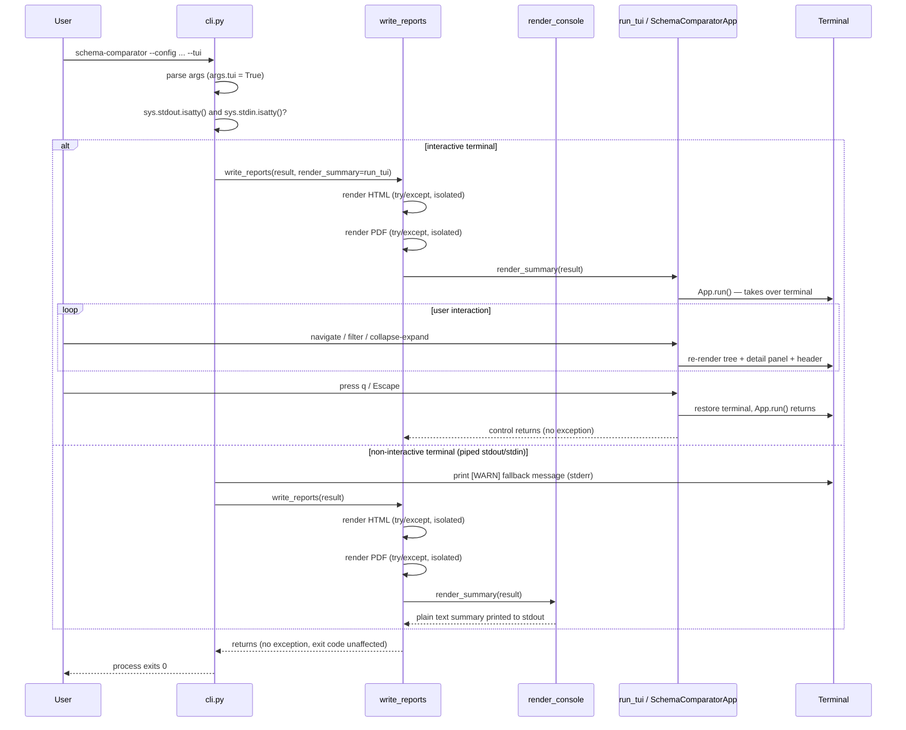

Design: Interactive TUI (`--tui` flag)

Change: `interactive-tui`
Status: design (phase artifact)
Scope: an opt-in, read-only Textual TUI that renders a `ComparisonResult`
as a filterable/collapsible findings tree with a detail panel and a
counts/profile header, launched via `--tui` on an interactive terminal,
falling back to the existing plain console summary otherwise. HTML/PDF
generation is untouched in every case.

This design realizes the ten requirements in
`openspec/changes/interactive-tui/specs/interactive-tui/spec.md` and the
five decisions recorded in `openspec/changes/interactive-tui/proposal.md`.
It consumes, read-only, the frozen `ComparisonResult`/`DiffEntry` shapes
from `src/schema_comparator/compare/models.py` and stays consistent with
the grouping/counting conventions already established by
`src/schema_comparator/report/console.py`.

---

## 1. Module / file layout

```text
src/schema_comparator/tui/
  __init__.py     # corrected docstring + public API surface (App class only)
  app.py          # SchemaComparatorApp(App) — Textual App subclass, bindings, screen wiring
  widgets.py      # FindingsTree (Tree subclass) + DetailPanel (Static/Widget) + SummaryHeader
  formatting.py   # pure, sync functions: tree-building, filter-matching, detail/header text
```

- `formatting.py` holds every function that only needs a `ComparisonResult`
  (or a single `DiffEntry`) and returns plain data/strings — no Textual
  imports, no widget/App state. This is what the proposal calls out as
  "independently unit-testable without the `Pilot` harness," and it is the
  layer `console.py`-consistency is enforced against (both `formatting.py`
  and `console.py` derive header counts the same way; `formatting.py`
  imports `_TYPE_LABELS`-equivalent logic from `console.py` rather than
  redefining it, see §3.3).
- `widgets.py` holds Textual widget subclasses that call into
  `formatting.py` to build their content but own no comparison-specific
  business logic themselves.
- `app.py` holds the `App` subclass: layout composition, key `Binding`s,
  reactive filter state, and the widgets' wiring together. It is the only
  module that constructs the full screen.
- `__init__.py` re-exports the public entry point (`SchemaComparatorApp`,
  and the `run_tui` launcher function used by `cli.py`) and carries the
  corrected docstring (Decision 5, §7).

This mirrors the `compare/` and `report/` packages' existing shape
(`models`/pure-logic module separated from I/O or presentation-specific
orchestration) rather than introducing a new structural convention.

---

## 2. Data flow: `ComparisonResult` → Tree structure

### 2.1 Grouping (REQ-003, REQ-010)

`formatting.build_tree_data(result: ComparisonResult) -> TreeData` groups
`result.entries` by `entry.qualified_name` using the same
`itertools.groupby` pattern `console.py` already uses (entries are
pre-sorted by table identity by construction — the engine never emits them
out of order, matching the invariant `console.py` already relies on
without re-sorting). It returns a plain, Textual-independent structure:

```python
# formatting.py
@dataclass(frozen=True, slots=True)
class TableGroup:
    schema_name: str
    table_name: str
    entries: tuple[DiffEntry, ...]

    @property
    def qualified_label(self) -> str:
        return f"{self.schema_name}.{self.table_name}"


@dataclass(frozen=True, slots=True)
class TreeData:
    groups: tuple[TableGroup, ...]


def build_tree_data(result: ComparisonResult) -> TreeData:
    groups = [
        TableGroup(schema_name=schema, table_name=table, entries=tuple(entries))
        for (schema, table), entries in groupby(result.entries, key=lambda e: e.qualified_name)
    ]
    return TreeData(groups=tuple(groups))
```

`app.py`'s `FindingsTree.populate(tree_data: TreeData)` then walks
`tree_data.groups`, adding one root-level `TreeNode` per `TableGroup`
labeled `group.qualified_label`, and one leaf `TreeNode` per entry in
`group.entries`, labeled via `formatting.leaf_label(entry)` — a function
mirroring `console.py`'s three `isinstance` branches exactly (same
"missing table (from X)" / "missing column (from X)" / "attribute mismatch
across A, B" text), so the TUI's leaf text is never a second, drifting
implementation of that formatting.

Each `TreeNode.data` is set to the originating `DiffEntry` instance (Tree
widgets support attaching arbitrary node data) — this is what makes leaf
selection (§2.2) and filtering (§2.3) able to inspect the underlying entry
without re-parsing the rendered label text.

### 2.2 Detail panel content (REQ-009)

`formatting.detail_text(entry: DiffEntry) -> str` is a single-dispatch pure
function:

```python
def detail_text(entry: DiffEntry) -> str:
    if isinstance(entry, ColumnMismatch):
        lines = [f"Column: {entry.qualified_name[0]}.{entry.qualified_name[1]}.{entry.column_name}", ""]
        for profile, attrs in entry.values_by_profile:
            lines.append(
                f"  {profile}: data_type={attrs.data_type}, "
                f"char_max_length={attrs.character_maximum_length}, "
                f"numeric_precision={attrs.numeric_precision}, "
                f"numeric_scale={attrs.numeric_scale}, "
                f"is_nullable={attrs.is_nullable}"
            )
        return "\n".join(lines)

    # MissingTable / MissingColumn share the same simpler shape.
    what = "table" if isinstance(entry, MissingTable) else f"column '{entry.column_name}'"
    return (
        f"{entry.qualified_name[0]}.{entry.qualified_name[1]}: "
        f"{what} missing from profile '{entry.missing_from_profile}'"
    )
```

`DetailPanel` (a `Static` subclass in `widgets.py`) exposes
`show(entry: DiffEntry | None)`, calling `detail_text` and updating its
renderable, or showing a neutral "select a finding to see details" message
when `entry is None` (e.g. a table-group header is selected, not a leaf).
`app.py` wires `FindingsTree`'s node-highlighted/selected event to call
`self.detail_panel.show(node.data)`, passing `None` when the highlighted
node is a group header (`node.data` unset for group nodes).

### 2.3 Header content (REQ-010)

`formatting.header_counts(result: ComparisonResult) -> dict[type, int]`
reuses exactly the same counting approach as `console.py`'s
`render_console` (a `dict.fromkeys(_TYPE_LABELS, 0)` accumulation over
`result.entries`), guaranteeing the counts cannot diverge:

```python
from schema_comparator.report.console import _TYPE_LABELS

def header_counts(result: ComparisonResult) -> dict[type, int]:
    counts = dict.fromkeys(_TYPE_LABELS, 0)
    for entry in result.entries:
        counts[type(entry)] += 1
    return counts


def header_text(result: ComparisonResult) -> str:
    counts = header_counts(result)
    profiles = ", ".join(result.compared_profiles)
    parts = [f"Compared profiles: {profiles}"]
    parts += [f"{label}: {counts[t]}" for t, label in _TYPE_LABELS.items()]
    return " | ".join(parts)
```

Importing `_TYPE_LABELS` from `console.py` (rather than redefining an
equivalent mapping in `formatting.py`) is a deliberate single-source-of-
truth choice: REQ-010 explicitly requires the header counts to never
diverge from `render_console`'s counts, and importing the same private
mapping is the only way to make that a structural guarantee instead of a
convention two people have to remember to keep in sync. `console.py`'s
`_TYPE_LABELS` stays a module-level constant (no `__all__` change needed
for a same-package, well-established Python pattern of an underscore-
prefixed name imported by a closely related sibling module).

`SummaryHeader` (a `Static` subclass) renders `header_text(result)` once at
`App.compose()`/`on_mount()` time — the header is static per run; it does
not change as the user filters or navigates (REQ-010 does not require it
to reflect filtered counts, only the result's totals).

### 2.4 Empty-result handling (REQ-007)

`formatting.build_tree_data` returns `TreeData(groups=())` for an empty
`result.entries`. `app.py`'s `on_mount` checks
`if not tree_data.groups:` and, instead of mounting an empty `FindingsTree`,
mounts a `Static("No drift detected across all compared profiles.")` in
its place (reusing the exact clean-comparison sentence `console.py` already
uses, again for phrasing consistency) — never an empty, unexplained tree
widget.

---

## 3. TTY detection and console fallback (REQ-001, REQ-002)

### 3.1 Where the check lives

Per Decision 1, the check is exactly two calls in `cli.py`, immediately
after parsing arguments and before calling `write_reports`:

```python
# cli.py
import sys
from schema_comparator.report.write import write_reports
from schema_comparator.tui import run_tui


def _resolve_summary_renderer(use_tui: bool):
    if not use_tui:
        return None  # write_reports keeps its own default (render_console)
    if sys.stdout.isatty() and sys.stdin.isatty():
        return run_tui
    print(
        "[WARN] --tui requires an interactive terminal; "
        "falling back to plain console summary",
        file=sys.stderr,
    )
    return None  # fall back to write_reports's default renderer
```

`build_arg_parser()` gains:

```python
parser.add_argument(
    "--tui",
    action="store_true",
    help="Launch an interactive findings browser instead of the plain "
    "console summary (requires an interactive terminal)",
)
```

`main()` calls:

```python
render_summary = _resolve_summary_renderer(args.tui)
if render_summary is not None:
    write_reports(result, render_summary=render_summary)
else:
    write_reports(result)
```

Passing `None`-vs-omitting keeps `write_reports`'s default parameter value
(`_default_console_summary`, wrapping today's `render_console` call) as the
single source of truth for "what does the console summary look like" —
`cli.py` never re-implements that default, it only ever decides whether to
override it with `run_tui`.

### 3.2 `write_reports` signature change

Per Decision 1, exactly one new parameter, added after the existing
`out` keyword-only parameter, with no change to the HTML/PDF try/except
blocks:

```python
# report/write.py
from typing import Callable

def _default_console_summary(result: ComparisonResult, *, out=sys.stdout) -> None:
    print(render_console(result), file=out)


def write_reports(
    result: ComparisonResult,
    *,
    out=sys.stdout,
    render_summary: Callable[[ComparisonResult], None] = _default_console_summary,
) -> None:
    ...  # HTML try/except and PDF try/except: unchanged
    try:
        render_summary(result)
    except Exception as exc:
        print(f"[ERROR] Console summary generation failed: {exc}", file=out)
```

`render_summary`'s call signature is `Callable[[ComparisonResult], None]`
— a one-argument callable. `_default_console_summary` needs `out` bound at
call time; `cli.py` never passes a partially-applied `out`-aware callable
today (`write_reports` always defaults `out=sys.stdout`), so this is not a
behavior change: the existing call sites (`cli.py`, all current tests) that
never override `out` are unaffected. If a future caller needs a
non-default `out` *and* a non-default `render_summary` simultaneously, that
caller is responsible for closing over `out` itself when constructing its
`render_summary` callable — out of scope for this change since no current
caller does so.

### 3.3 `run_tui` — the TUI-invoking summary callable (REQ-008)

`run_tui` is the function passed as `render_summary` when `--tui` is
active. It matches the `Callable[[ComparisonResult], None]` shape and is
responsible for satisfying REQ-008 (a TUI failure must not propagate as an
unhandled exception, must be reported clearly, and must not corrupt the
terminal):

```python
# tui/app.py
def run_tui(result: ComparisonResult) -> None:
    app = SchemaComparatorApp(result)
    try:
        app.run()
    except Exception as exc:
        print(f"[ERROR] Interactive TUI failed: {exc}", file=sys.stderr)
```

Textual's `App.run()` already restores the terminal to its prior state in
its own `finally`-equivalent teardown (part of Textual's driver lifecycle)
even when an exception propagates out of the running app, so no additional
terminal-restoration code is needed here — `run_tui`'s `try/except` exists
purely to satisfy "reported clearly, not an unhandled exception," not to
do terminal cleanup Textual does not already do. This exception boundary
is also why `write_reports`'s own `try/except` around `render_summary`
(§3.2) is a defense-in-depth measure, not the primary one: `run_tui` should
never let an exception reach `write_reports` at all in the common case.

---

## 4. Key bindings and reactive filter state (REQ-003, REQ-004, REQ-005, REQ-006)

`SchemaComparatorApp` declares its bindings as a class-level `BINDINGS`
list, Textual's standard mechanism:

```python
# tui/app.py
from textual.app import App, ComposeResult
from textual.binding import Binding
from textual.reactive import reactive
from textual.widgets import Footer, Input

class SchemaComparatorApp(App):
    BINDINGS = [
        Binding("q", "quit", "Quit"),
        Binding("escape", "quit", "Quit", show=False),
        Binding("slash", "focus_filter", "Filter"),
    ]

    filter_text: reactive[str] = reactive("")

    def __init__(self, result: ComparisonResult) -> None:
        super().__init__()
        self._result = result
        self._tree_data = build_tree_data(result)

    def compose(self) -> ComposeResult:
        yield SummaryHeader(header_text(self._result))
        yield Input(placeholder="Filter by table, column, or diff type…", id="filter-input")
        yield FindingsTree(self._tree_data, id="findings-tree")
        yield DetailPanel(id="detail-panel")
        yield Footer()

    def action_focus_filter(self) -> None:
        self.query_one("#filter-input", Input).focus()

    def on_input_changed(self, event: Input.Changed) -> None:
        if event.input.id == "filter-input":
            self.filter_text = event.value

    def watch_filter_text(self, filter_text: str) -> None:
        self.query_one(FindingsTree).apply_filter(filter_text)
```

- **Quit (REQ-006):** `q` and `Escape` both map to Textual's built-in
  `action_quit`, which calls `App.exit()` — no custom quit logic is
  needed since the TUI performs no write/editing action to guard against
  on exit.
- **Filter focus (REQ-004):** `/` (Textual binding key `slash`) calls a
  custom `action_focus_filter` that moves focus to the `Input` widget;
  actual filtering happens reactively via `filter_text`
  (a Textual `reactive` attribute) — every keystroke in the `Input`
  fires `on_input_changed`, which updates `filter_text`, whose `watch_`
  method Textual calls automatically, which then calls
  `FindingsTree.apply_filter`. This reactive-attribute pattern (rather
  than calling the tree directly from `on_input_changed`) is Textual's
  idiomatic way to decouple "filter text changed" from "what happens as a
  result," and keeps `apply_filter`'s pure matching logic (§4.1) testable
  independently of the `Input` widget's change event.
- **Navigation (REQ-003):** arrow keys and `j`/`k` are `Tree` widget
  built-ins in Textual (a `Tree` already binds `up`/`down`/`j`/`k` to
  cursor movement) — no custom `Binding` entries are added for these;
  `FindingsTree` inherits them from `textual.widgets.Tree` without
  overriding.
- **Collapse/expand (REQ-005):** `Enter`/`Space` toggling an expanded/
  collapsed node is also a `Tree` widget built-in
  (`Tree.action_toggle_node`, bound by default) — `FindingsTree` does not
  override this binding; it only supplies the node data (§2.1) that the
  built-in toggle acts on.

### 4.1 Filter matching (`formatting.py`, pure and sync)

```python
# formatting.py
def entry_matches(entry: DiffEntry, filter_text: str) -> bool:
    """Case-insensitive substring match over diff-type label, qualified
    table name, and column name (when present)."""
    if not filter_text:
        return True
    needle = filter_text.lower()
    schema, table = entry.qualified_name
    haystacks = [type(entry).__name__, schema, table]
    if isinstance(entry, (MissingColumn, ColumnMismatch)):
        haystacks.append(entry.column_name)
    return any(needle in haystack.lower() for haystack in haystacks)
```

`FindingsTree.apply_filter(filter_text: str)` walks its mounted nodes:
for each leaf node, it calls `entry_matches(node.data, filter_text)` and
sets the node's visibility (Textual `TreeNode` supports removing/hiding
children, or the tree is rebuilt from `tree_data` filtered in-memory —
implementation detail decided at coding time between "toggle
`node.allow_expand`/visibility flags" vs. "rebuild filtered `TreeData` and
repopulate"; either satisfies REQ-004's observable contract). A group
node is hidden only when **none** of its leaf entries match (mirroring
`entry_matches` applied across `group.entries`), matching REQ-004's
"table groups with no remaining matches are hidden" scenario. Clearing
`filter_text` back to `""` makes `entry_matches` return `True`
unconditionally, restoring full visibility — satisfying the "clearing the
filter restores all findings" scenario without a separate code path.

---

## 5. TUI failure isolation and terminal safety (REQ-008)

Already covered structurally in §3.3 (`run_tui`'s `try/except`, Textual's
own driver teardown on `App.run()` exit) and §3.2 (`write_reports`'s
outer `try/except` around `render_summary` as defense-in-depth). No
additional design is needed: HTML/PDF generation in `write_reports`
already completes, in source order, before the `render_summary(result)`
call is reached — this ordering is pre-existing and unchanged by this
design, which only adds a parameter to the pre-existing final step.

---

## 6. Sequence diagram: `--tui` flow



---

## 7. Correcting `tui/__init__.py` (Decision 5)

Current docstring:

```python
"""Textual App and screens (connections list, add/edit connection, run/report)."""
```

New docstring, scoped to this change's fixed v1 surface, plus the public
API re-export:

```python
"""Read-only interactive findings browser for a ComparisonResult.

Launched via the CLI's --tui flag on an interactive terminal (see
schema_comparator.cli): a single-screen Textual app presenting findings
grouped by table, with live substring filtering, collapse/expand of table
groups, a detail panel for the selected finding, and a quit key binding.
No connection-management screens and no run/re-extract action exist here
— those are not implemented by this module. See
openspec/changes/interactive-tui/proposal.md Decision 5 for the scope
correction rationale.
"""

from schema_comparator.tui.app import SchemaComparatorApp, run_tui

__all__ = ["SchemaComparatorApp", "run_tui"]
```

---

## 8. Dependencies (`pyproject.toml`)

Per Decision 2:

```toml
[project]
dependencies = [
    "PyYAML>=6.0",
    "pyodbc>=5.0",
    "Jinja2>=3.1",
    "xhtml2pdf>=0.2.13",
    "textual>=0.60",
]

[project.optional-dependencies]
dev = [
    "pytest>=8.0",
    "pytest-cov>=5.0",
    "pytest-asyncio>=0.24",
]

[tool.pytest.ini_options]
asyncio_mode = "strict"
```

`asyncio_mode = "strict"` (not `"auto"`) means only tests explicitly
decorated `@pytest.mark.asyncio` run under `pytest-asyncio`'s event loop —
the existing fully-synchronous suite (`tests/unit/...`,
`tests/integration/...`) is unaffected, matching Decision 2's stated
rationale. A version floor of `textual>=0.60` is chosen as a placeholder
consistent with a modern `Tree`/`Pilot`/`run_test()` API surface; the
exact floor should be confirmed against whatever `textual` version is
available in the project's resolved environment at implementation time
(not re-verified as part of this design phase).

---

## 9. Testing strategy (TDD)

Per `stack-python-testing` conventions (red-green-refactor, one behavior
per test, descriptive names, fixtures, mock external boundaries) and the
proposal's explicit split between pure-function tests and `Pilot`-driven
tests.

### 9.1 Pure-function unit tests (synchronous, no `Pilot`, no `pytest-asyncio`)

`tests/unit/tui/test_formatting.py` — new file, mirrors existing
`tests/unit/compare/test_models.py`-style fixtures for building small
`ComparisonResult` instances:

- `test_build_tree_data_groups_by_qualified_table_name` (REQ-003)
- `test_build_tree_data_returns_empty_groups_for_empty_result` (REQ-007)
- `test_leaf_label_matches_console_missing_table_wording` (consistency
  with `console.py`)
- `test_leaf_label_matches_console_missing_column_wording`
- `test_leaf_label_matches_console_column_mismatch_wording`
- `test_detail_text_for_column_mismatch_lists_all_profiles_and_attributes`
  (REQ-009)
- `test_detail_text_for_missing_table_shows_missing_from_profile` (REQ-009)
- `test_detail_text_for_missing_column_shows_missing_from_profile`
  (REQ-009)
- `test_detail_text_never_renders_values_by_profile_for_missing_entries`
  (REQ-009, explicit negative assertion)
- `test_header_counts_match_console_type_labels_mapping` (REQ-010,
  asserts against `console._TYPE_LABELS` directly to make the
  single-source-of-truth guarantee from §2.3 a tested invariant, not
  just a code-review observation)
- `test_header_text_lists_compared_profiles` (REQ-010)
- `test_entry_matches_by_diff_type_label` (REQ-004)
- `test_entry_matches_by_table_name` (REQ-004)
- `test_entry_matches_by_column_name` (REQ-004)
- `test_entry_matches_is_case_insensitive`
- `test_entry_matches_returns_true_for_empty_filter_text` (REQ-004,
  "clearing the filter restores all findings")

### 9.2 `Pilot`-driven interaction tests (async, `@pytest.mark.asyncio`)

`tests/unit/tui/test_app.py` — new file, using
`async with app.run_test() as pilot:` per Decision 2:

- `test_app_shows_header_with_profiles_and_counts` (REQ-010): mount app,
  assert `SummaryHeader` renderable contains expected profile names and
  counts.
- `test_app_shows_no_drift_message_for_empty_result` (REQ-007): mount app
  with an empty-entries `ComparisonResult`, assert no `Tree` is present
  and the "no drift detected" `Static` is.
- `test_app_tree_shows_one_group_per_table` (REQ-003): mount app, inspect
  `FindingsTree` root children count/labels.
- `test_app_expanding_group_reveals_findings` (REQ-003, REQ-005):
  `pilot.press("enter")` on a group node, assert child nodes become
  visible.
- `test_app_collapsing_group_hides_findings_keeps_header` (REQ-005):
  toggle twice, assert group label still present but leaves hidden after
  second toggle.
- `test_app_filter_input_hides_non_matching_findings` (REQ-004):
  `pilot.press("slash")`, type a diff-type label via `pilot.press` per
  character, assert only matching leaves are visible.
- `test_app_clearing_filter_restores_all_findings` (REQ-004): filter then
  clear the `Input`, assert full tree visibility restored.
- `test_app_selecting_leaf_updates_detail_panel` (REQ-009):
  `pilot.press` navigation to a `ColumnMismatch` leaf, assert
  `DetailPanel`'s renderable contains all `values_by_profile` rows.
- `test_app_quit_key_exits_app` (REQ-006): `pilot.press("q")`, assert
  `app.is_running` is `False` / `run_test()`'s context exits cleanly.
- `test_app_escape_key_exits_app` (REQ-006): same as above via `escape`.

### 9.3 `cli.py` unit tests

Extends the existing `tests/unit/test_cli.py`:

- `test_tui_flag_defaults_to_false` (REQ-001)
- `test_tui_flag_on_tty_passes_run_tui_as_render_summary` (REQ-001):
  mock `sys.stdout.isatty`/`sys.stdin.isatty` to `True`, assert
  `write_reports` is called with `render_summary=run_tui`
  (via `unittest.mock.patch` on `schema_comparator.report.write.write_reports`,
  mocking the external Textual-invoking boundary rather than actually
  driving a `Pilot` session from a CLI-level test).
- `test_tui_flag_on_non_tty_prints_warning_and_uses_default_renderer`
  (REQ-002): mock both `isatty` checks to `False`, assert the `[WARN]`
  line is printed to `stderr` and `write_reports` is called without a
  `render_summary` override (or with the default explicitly — whichever
  the implementation chooses, asserted structurally).
- `test_tui_flag_on_non_tty_exit_code_is_zero` (REQ-002, Decision 3):
  asserts `main()` does not raise / process exit code is unaffected by
  the fallback branch.

### 9.4 `write_reports` regression tests

Extends the existing `tests/unit/report/test_write.py` (per
`tests/unit/report/conftest.py`'s existing fixtures):

- `test_write_reports_default_render_summary_matches_prior_console_output`
  (regression guard: no `render_summary` argument behaves identically to
  before this change).
- `test_write_reports_calls_custom_render_summary_when_provided`
  (asserts the injected callable receives the same `ComparisonResult`
  passed to `write_reports`).
- `test_write_reports_isolates_render_summary_failure_from_html_pdf`
  (REQ-008: a `render_summary` that raises must not affect the
  already-written HTML/PDF paths — extends the existing per-format
  isolation test pattern).

All new/changed test modules follow the existing repo convention of one
behavior asserted per test with a descriptive `test_<behavior>` name, and
mock only the true external boundary (`sys.stdout`/`sys.stdin.isatty`,
`write_reports`) rather than internal collaborators like `formatting.py`'s
pure functions, which are exercised directly and are cheap enough to run
unmocked in both the pure-function and `Pilot` test layers.

---

## 10. Exact file change list

### New files

- `src/schema_comparator/tui/app.py`
- `src/schema_comparator/tui/widgets.py`
- `src/schema_comparator/tui/formatting.py`
- `tests/unit/tui/__init__.py`
- `tests/unit/tui/test_formatting.py`
- `tests/unit/tui/test_app.py`

### Modified files

- `src/schema_comparator/tui/__init__.py` — corrected docstring (Decision
  5), re-export `SchemaComparatorApp`/`run_tui`.
- `src/schema_comparator/cli.py` — add `--tui` flag, TTY-detection
  (`_resolve_summary_renderer`), wire `render_summary` into
  `write_reports`.
- `src/schema_comparator/report/write.py` — add `render_summary` parameter
  and `_default_console_summary` helper; no change to HTML/PDF
  try/except blocks.
- `pyproject.toml` — add `textual` to `[project].dependencies`, add
  `pytest-asyncio` to `[project.optional-dependencies].dev`, add
  `[tool.pytest.ini_options] asyncio_mode = "strict"`.
- `tests/unit/test_cli.py` — new `--tui`/TTY-detection test cases (§9.3).
- `tests/unit/report/test_write.py` — new `render_summary` injection/
  isolation test cases (§9.4).

No other file is touched: `compare/models.py`, `discovery/*`,
`report/console.py`, `report/html.py`, `report/pdf.py` are read-only
inputs to this change, matching the proposal's Non-Goals.

---

## 11. Risks and open follow-ups for `sdd-tasks`

- **Textual version floor** (§8): `textual>=0.60` is a placeholder; the
  task-breakdown/implementation phase should pin an exact version after
  confirming `Tree`/`Pilot`/`run_test()` API compatibility in the
  project's actual dependency resolution.
- **Tree node visibility mechanism** (§4.1): whether filtering hides
  nodes via a visibility flag or rebuilds the tree from filtered
  `TreeData` is left as an implementation-time choice between two
  behaviorally-equivalent approaches — `sdd-tasks` should pick one
  explicitly rather than leaving it ambiguous across multiple PRs.
- **`write_reports` non-default `out` + non-default `render_summary`
  combination** (§3.2): intentionally out of scope; flagged so a future
  change does not silently assume `render_summary` closures always see
  the caller's `out` value.
